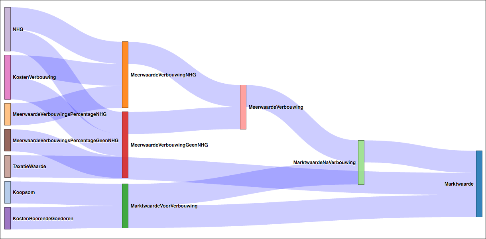

# Rabo-rules
Rabo-Rules is a forward chaining rule engine, built in [Scala](https://www.scala-lang.org). The engine comes with a DSL with which derivations can be modelled as small steps that combine into large derived networks of facts.

The project started with a Dutch DSL to facilitate bankers writing mortgage-related calculations. The development of an English DSL is currently in progress (see [Future Work](#future)).

[](https://codeship.com/projects/146192)

# Getting Started

The minimal requirement to get started is to add the artifact containing the rule engine to your project. Below are snippets for SBT and Maven. Be sure to check if any newer versions are available and adjust the snippets accordingly.

**SBT** - `build.sbt`
```
libraryDependencies += "nl.rabobank.oss.rules" %% "rule-engine" % "0.6.0"
```

**Maven** - `pom.xml`
```xml
<dependency>
	<groupId>nl.rabobank.oss.rules</groupId>
	<artifactId>rule-engine_2.11</artifactId>
	<version>0.6.0</version>
</dependency>
```

# Concepts

The rule engine uses a `Fact` as the base for all of its derivations. A `Fact` defines its name and type so it can be referenced in evaluations down the road. `Facts` are best defined inside a `Glossary`:

```scala
object MyGlossary extends Glossary {
	val factA = defineFact[Int]
	val factB = defineFact[Int]
	val factC = defineFact[Int]
}
```

*Note: the name of the fact is automatically deduced from the variable it is assigned to. `defineFact` has an optional parameter for a description of the fact.*

Using this glossary, it is now possible to define derivations. The Scala Rules DSL provides an easy way to express how facts interact and come together to form your logic. To enable the DSL, create a class that extends `Berekening`:

```scala
import nl.rabobank.oss.rules.dsl.nl.grammar._
import MyGlossary._

class MyArithmetics extends Berekening (
	Gegeven (factA > 0) Bereken factC is factB - factA 
)
```

*Note the parenthesis behind `Berekening`, using braces won’t work. The `Berekening` constructor requires a series of `DslDerivations`, using braces causes this argument to be an empty list and yields you no executable derivations.*

*Note 2: for more information about the possibilities of the DSL, see the [Wiki page about it](https://github.com/rabobank-nederland/rule-engine/wiki/DSL-Description---Dutch)*

The two listings above are actually all you need to define your calculations, validations or evaluations. The engine will have enough information to start working for you. Only one thing is still missing for the scenario to make sense to you: values.

The engine requires you to construct a `Context` mapping a set of initial `Facts` to their values. When you have that, you can let the engine do the rest:

```scala
val initialContext: Context = Map(
  factA -> 4,
  factB -> 10
)
val derivations: List[Derivation] = new MyArithmetics().berekeningen

val resultContext: Context = FactEngine.runNormalDerivations(initialContext, derivations)

println(PrettyPrinter.printContext(resultContext))
```

Executing the above code will yield the following:

```
Values in context:
  factA = 4
  factB = 10
  factC = 6
Done.
```

# Debugging

If you want to see exactly what the engine is doing, you can replace the `runNormalDerivations` with `runDebugDerivations`. The return type of that function is a tuple containing the resulting `Context` and a list of `Step` objects. The latter describe exactly what actions the engine performed and why:

```scala
val initialContext: Context = Context(
  factA -> 4,
  factB -> 10
)
val derivations: List[Derivation] = new MyArithmetics().berekeningen

val (resultContext, steps) = FactEngine.runDebugDerivations(initialContext, derivations)

println(PrettyPrinter.printSteps(steps))
```

Executing this snippet will yield an overview of the steps taken by the engine:

```
Steps taken:
 * Evaluate: factC
   * Result: Evaluated
   * Change: Map(factC -> 6)
Done.
```

For each step there is the `Fact` that was about to be evaluated (`factC`). Next is the status of the evaluation. The engine might indicate that the condition was false and thus the evaluation was skipped. Finally the `change` field shows what is added to the `Context` as a result of this evaluation.

# Going Hardcore

If you have complicated tasks to perform, or our DSL simply does not fit your needs, you can write custom evaluations.

The DSL in the `Berekening` class yields a list of `Derivation`-objects. Constructing one yourself is not difficult, but requires some explanation:

```
case class DefaultDerivation(
  input: List[Fact[Any]], 
  output: Fact[Any], 
  condition: Context => Boolean, 
  operation: Evaluation[Any]) extends Derivation
```

For a derivation to work, the engine must know all the `Facts` it uses as input. The `input` parameter requires you to provide these `Facts` as a list.

The `output` allows the engine to store the result of the derivation in the `Context`. The `output` fact is the key for this.

The `condition` is a function to decide whether the `operation` should be executed. The function is provided with the current `Context` containing all values known at the point of execution. Returning `true` causes the `operation` to be executed, `false` will cause it to be skipped.

Finally, the `operation` is the function which will result in the value assigned to the `output` fact. You need to instantiate or extend any of the available `Evaluation` classes.


